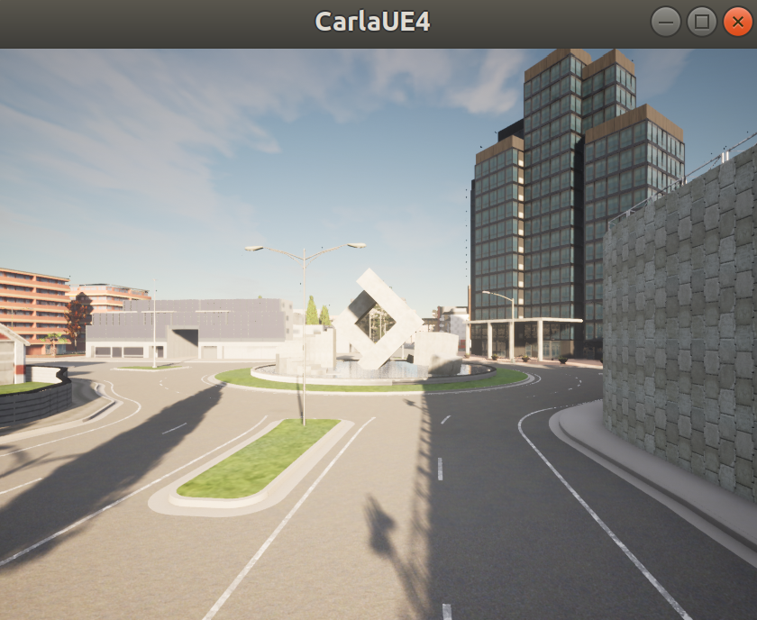
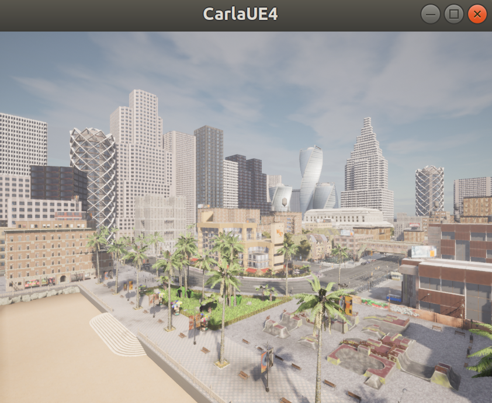

# HW0
## Introduction
In the following homeworks and final project we will need to use the CARLA simulator to simulate various traffic scenes. CARLA supports flexible specification of sensor suites, environmental conditions, full control of all static and dynamic actors, and most importantly, a PythonAPI for users to easily customize the environment and get control of the vehicles. 

This homework will guide you through the installation of CARLA and provide 4 driving benchmarks and 3 different baseline driving models to give you a quick view on how autonomous driving systems looked like in CARLA.

## System Requirements
- Unbuntu 18.04 or 20.04
- Intel i7 gen 9th - 14th / Intel i9 gen 9th - 14th / AMD ryzen 7 / AMD ryzen 9
- 16 GB RAM memory
- 8GB GPU or even better, e.g.:
  - NVIDIA RTX 2070 / NVIDIA RTX 2080 / NVIDIA RTX 3070, NVIDIA RTX 3080 
- At least 50GB free space (not including the space for training data in future homeworks or your project)

## Setting up your environment
In this homework we will use 2 versions of CARLA, 0.9.10 and 0.9.14, the version depending on which benchmark you choose. This section will guide you through the installation steps of both versions, and the corresponding version of each benchmark will be specified  in the [Benchmark](#benchmark) section.

### CARLA 0.9.10
  1. Download the packaged CARLA realse  
      ```shell
      chmod +x setup_carla_10.sh
      ./setup_carla_10.sh
      ```
  2. Open CARLA
      ```shell
      cd carla_10
      ./CarlaUE4.sh
      ``` 
      If you see a screen like this, it means CARLA 0.9.10 is successfully installed.
      

### CARLA 0.9.14
  1. Download the packaged [CARLA release](https://leaderboard-public-contents.s3.us-west-2.amazonaws.com/CARLA_Leaderboard_2.0.tar.xz).
  2. Unzip the package into a folder, e.g. carla_14
  3. Open CARLA
      ```shell
      cd carla_14
      ./CarlaUE4.sh
      ``` 
      If you see a screen like this, it means CARLA 0.9.14 is successfully installed.
      

## Benchmark
### Longest6
   

[Paper](https://www.cvlibs.net/publications/Chitta2022PAMI.pdf), [GitHub](https://github.com/autonomousvision/transfuser?tab=readme-ov-file)

### DOS
  

 [Paper](https://arxiv.org/pdf/2305.10507.pdf), [GitHub](https://github.com/opendilab/DOS)

### Interaction
  

### CARLA leaderboard 2.0
  
  [CARLA leaderboard 2.0](https://leaderboard.carla.org/get_started/)

## Baseline
### Transfuser++
  
 [Paper](https://arxiv.org/pdf/2306.07957.pdf), [GitHub](https://github.com/autonomousvision/carla_garage)

### TCP
  
  [Paper](https://arxiv.org/pdf/2206.08129.pdf), [GitHub](https://github.com/OpenDriveLab/TCP), [Model_ckpt](https://hkustconnect-my.sharepoint.com/personal/qzhangcb_connect_ust_hk/_layouts/15/onedrive.aspx?id=%2Fpersonal%2Fqzhangcb%5Fconnect%5Fust%5Fhk%2FDocuments%2FPublic%5FShared%5FOnline%2FPre%2Dtrain%20weights%2FTPC%5FTrained%5FModel%2Fbest%5Fmodel%2Eckpt&parent=%2Fpersonal%2Fqzhangcb%5Fconnect%5Fust%5Fhk%2FDocuments%2FPublic%5FShared%5FOnline%2FPre%2Dtrain%20weights%2FTPC%5FTrained%5FModel&ga=1)

### PlanT
  [Paper](https://arxiv.org/pdf/2210.14222.pdf), [GitHub](https://github.com/autonomousvision/plant)

## Submission
You don’t need to submit anything in this homework, but it is important for you to go through the steps in this homework, since we expect you to start to investigate what will be the topic of your midterm presentation and final project based on your observation after running several baselines on one or more benchmarks we provided.
